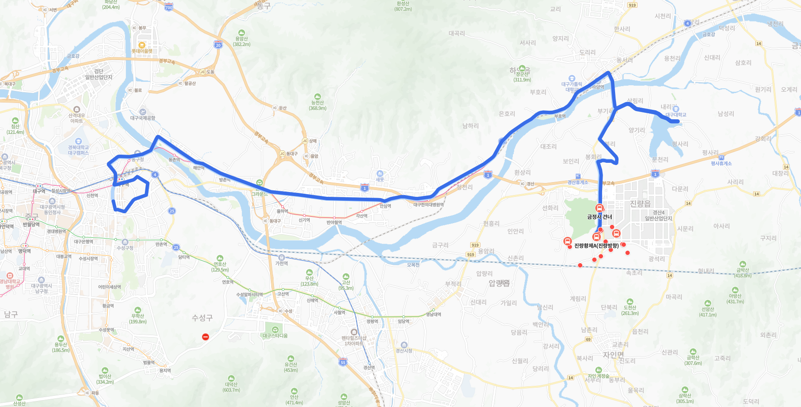

# 프로젝트 목표
**818번 버스 분석**

# 데이터셋 
https://www.gimi9.com/en/dataset/transportation-kr_prdtnum_000000020109/

# 분석 경로

https://naver.me/5EnLT5j8

# 프로젝트 가설

## 1. 회차별 버스정류장 분석
    회차별 데이터 정렬후 데이터 그래프 파악
### 그래프 목록
    a. 선그래프 회차별 데이터 그리기 (X축은 버스정류장 Class 분류, Y축은 회차에 따른 좌표)

## 2. 버스시간표 버스회차대별 버스 정류장 도착 편차 / 평균값 분석
    버스 회차대별 버스 정류장 도착 편차는 시간표에서 다음 버스의 시간 타이밍를 10분을 넣어서 오차 도착 시각 +10분을 하시오
### 그래프 목록
    a. 선그래프로 X축은 버스정류장 Class분류, Y축은 회차에 따른 선
    b. 선그래프로 에러바를 활용하여 전체 회차에 대한 최소값과 최대값 편차로 두어 그래프 그리기

## 3. ~~날씨별 버스 이동 편차 / 평균값 분석~~ (구현하지 않음.)
    날씨에 의한 버스 이동 편차 발생 여부 분석
### 그래프 목록
    a. 시계열 그래프로 날씨별 이벤트에 따라서 버스 이동 편차 발생 여부 분석 (월별, 일별, 시별로 그래프 그리기)
### 문제점
    근데 이거는 데이터가 너무 부족함 할거면 월별 데이터를 수집 해야함.
    현재 가지고 있는 전체 데이터는 2020년01월01일, 2020년01월07일자 (7일)의 데이터만 제공 받았음.

